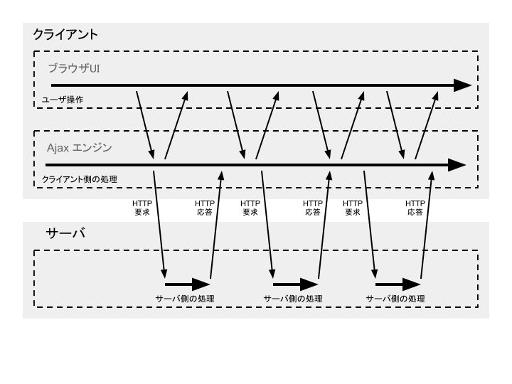
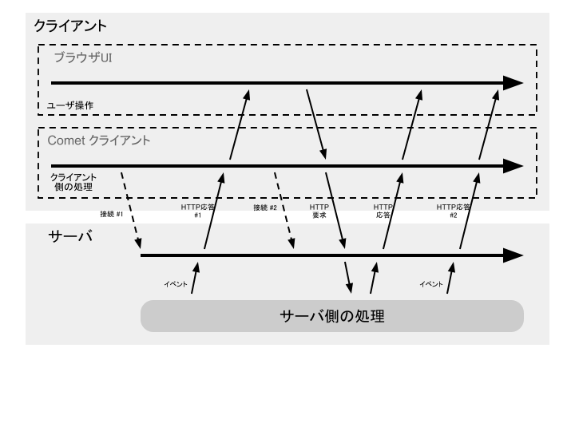
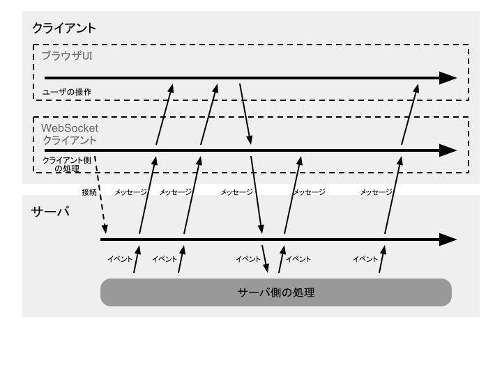
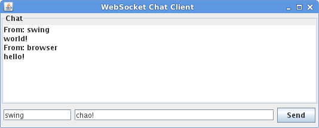
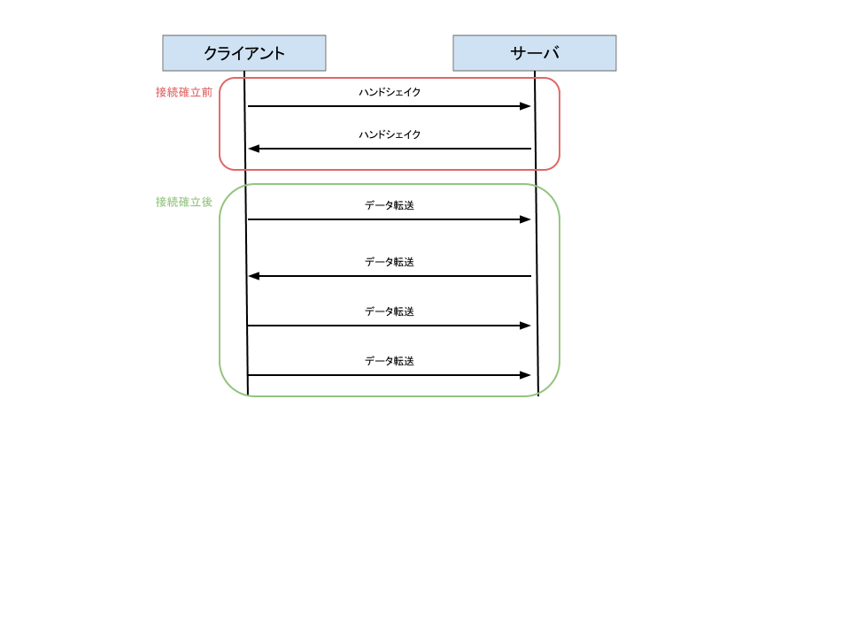
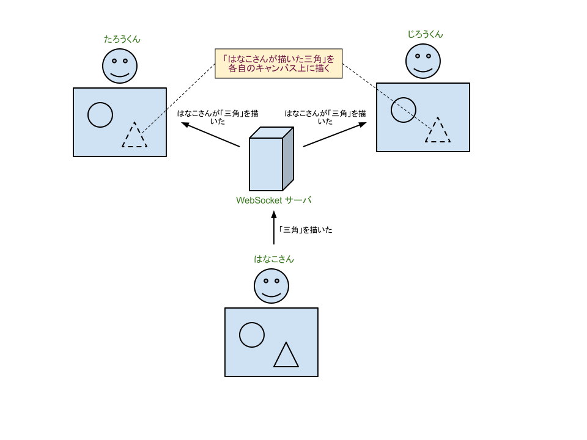

# WebSocket

# WebSocket 概要

## 何者？

WebSocket は通信プロトコルの 1 つです。ウェブサーバーとウェブブラウザとの間で双方向通信を可能とする規格です。API を W3C が、プロトコルを IETF が中 心となって規格策定を  進めています。

HTTP を応用した既存の双方向通信技術の欠点を解決する技術として開発されています。 元々は HTML5 の仕様の一部として策定が進められていましたが、現在は HTML5 から切り離され、独立したプロトコルとして規格策定作業が進められています。

ウェブサーバーとウェブブラウザ間で双方向通信ができるようになると、ウェブサーバからウェブブラウザに対して情報を Push することが可能になります。これはすなわち、Ajax を使ったなんちゃってリアルタイムアプリケーションではなく、本当のリアルタイム アプリケーションが実現できるようになるということです。

## 類似技術との比較

WebSocket 登場以前における、ウェブサーバーとウェブブラウザ間の双方向通信といえば、Ajax と Comet が挙げられます。ここでは、これらの技術と WebSocket の違いを挙げてみます。

### Ajax

Ajax もとい XMLHttpRequest を使ったアプリケーションは、厳密には双方向通信を実現 しているものではありません。定期的に XMLHttpRequest を用いた HTTP リクエストを発行し、ページ遷移なしに画面を更新することで、擬似的にリアルタイムアプリケーションを演じています。すなわち、

* リアルタイム性を追い求めると、無駄な通信が増える
* どんな少量の情報に対しても HTTP リクエストを発行するので、オーバーヘッドが大きい
* TCP 接続を行う
* それぞれの伝聞に HTTP ヘッダが付く

といった欠点があります。

### Comet

Comet は HTTP のロングポーリングを利用することで、ウェブサーバからの Push 通知を無理やり実現した技術です。おおまかに以下のような流れで、通信が推移します。

1. ブラウザからサーバへ HTTP 要求
2. サーバは要求を保留状態にしておく
3. サーバは任意のタイミングで 1 の要求に対して応答を返す
4. ブラウザは応答を処理し、次の Push 通知を待つ (1 に戻る)

この方式の欠点は、

* リクエストごとに HTTP 要求を発行する必要があるので、オーバーヘッドが大きい
* TCP 接続を行う
* それぞれの伝聞に HTTP ヘッダが付く
* HTTP コネクションを長い時間占有するので、同一サーバに接続する他アプリケーションに影響が及ぶ
* Push 通知を待つ項目の数だけ、HTTP コネクションを張る

### WebSocket

WebSocket は上述した Ajax、Comet が持つ問題を解決できます。

* 本当の Push 通知を持つので、無駄な通信が必要ない
* 1 つのコネクションでいくつもの情報をやり取りできる
* ヘッダが小さい
* 独自のプロトコルを持つので、HTTP コネクションを占有することはない

## 仕様策定、実装状況

TODO

# 簡単なサンプル

ここでは WebSocket を利用した 3 つの簡単なサンプルを紹介します。動作環境については各サンプルで紹介することにします。

## エコー

最初のサンプルとして、エコークライアント・サーバを WebSocket で作ってみます。

### 動作環境

<table>
  <tr>
    <th></th><th>環境</th><th>言語</th>
  </tr>
  <tr>
    <td>クライアント</td><td>Google Chrome</td><td>JavaScript</td>
  </tr>
  <tr>
    <td>サーバ</td><td><a href="http://www.tornadoweb.org/">Tornado</a></td><td>Python</td>
  </tr>
</table>

### クライアント

まず、`WebSocket` のインスタンスを構築します。

    var socket = new WebSocket("ws://localhost:8080/echo");

`WebSocket` のコンストラクタには接続先サーバのURLを指定します。スキーマには「ws://」か「wss://」を指定しなければなりません。
JavaScript の WebSocket API では、`WebSocket` を new すると、サーバへの接続が開始されます（非同期）。`WebSocket` を new した後は、コールバックを設定します。

    socket.onopen = function() {
      document.getElementById("send").addEventListener("click", function() {
        var text = document.getElementById("text").value;
        socket.send(text);
      });
    }

`onopen` は `WebSocket` の接続が確立されたタイミングで呼び出されるコールバックです。接続が確立されたタイミングで、ボタンにイベントリスナを登録します。イベントリスナの内部では、テキストフィールドに入力されたテキストを `WebSocket#send` を使って送信しています。

最後に、サーバからのエコーを受け取るよう、コールバックを設定します。

    socket.onmessage = function(msg) {
      var responses = document.getElementById("response");
      responses.innerHTML = responses.innerHTML + " " + msg.data;
    }

`onmessage` はサーバからのメッセージを受信したタイミングで呼び出されるコールバックです。引数にサーバからのメッセージを受け、メッセージの `data` プロパティにその本文を含みます。

以下、クライアントのコード全体です。

    <!DOCTYPE html>
    <html>
      <meta charset="UTF-8">
      <head><title>Echo Client</title></head>
      <body>
        <textarea rows="3" cols="30" id="text"></textarea> 
        <input type="submit" name="submit" id="send" value="send"></input>
        

        
      </body>
    </html>

### サーバ

サーバのコードは利用する環境によって大きく異なってきますが、この章のサンプルでは Python で実装された Web サーバである Tornado を使うことにします。

ここではエコーサーバを実装するので、クライアントが送信したメッセージを、そっくりそのままクライアントに返すような実装になります。

    class EchoHandler(WebSocketHandler):
        def on_message(self, message):
            self.write_message(u"You said: " + message)

    app = Application([
        (r"/", MainHandler),
        (r"/echo", EchoHandler)
        ])

Tornado では `WebSocketHandler` クラスを継承することで、WebSocket を処理するハンドラを定義します。これを "/echo" にバインドしています。

`on_message` メソッドは、クライアントからのメッセージを受信したタイミングで呼び出されるメソッドです。受け取ったメッセージをそのまま `write_message` メソッドに渡すことで、クライアントにメッセージを返しています。

以下、サーバのコード全体です。

    #!/usr/bin/python
    # -*- coding: utf-8 -*-

    from tornado.ioloop import IOLoop
    from tornado.web import Application, RequestHandler
    from tornado.websocket import WebSocketHandler

    class MainHandler(RequestHandler):
        def get(self):
            self.render("echo.html")

    class EchoHandler(WebSocketHandler):
        def on_message(self, message):
            self.write_message(u"You said: " + message)

    app = Application([
        (r"/", MainHandler),
        (r"/echo", EchoHandler)
        ])

    if __name__ == "__main__":
        app.listen(8080)
        IOLoop.instance().start()

## チャット

2 つ目のサンプルは、WebSocket の最も代表的な利用例として挙げられるチャットを作ってみます。エコークライアント・サーバと似たようなものではありますが、

* 構造化したデータをメッセージでやり取りする
* サーバ側で接続をコレクションする

といったところが異なります。

### 動作環境

<table>
  <tr>
    <th></th><th>環境</th><th>言語</th>
  </tr>
  <tr>
    <td>クライアント</td><td>Google Chrome</td><td>JavaScript</td>
  </tr>
  <tr>
    <td>サーバ</td><td><a href="http://www.tornadoweb.org/">Tornado</a></td><td>Python</td>
  </tr>
</table>

### クライアント

まずは `WebSocket` を構築します。

    var socket = new WebSocket("ws://localhost:8080/chat");

次に `onopen` コールバックを設定します。

    socket.onopen = function() {
      document.getElementById("send").addEventListener("click", function() {
        var name = document.getElementById("name").value;
        var text = document.getElementById("text").value;
        var msg = JSON.stringify({ name: name, text: text });
        socket.send(msg);
      });
    }

エコークライアントと同じように、接続が確立されたタイミングでボタンにイベントリスナを登録します。イベントリスナでは、名前と本文のテキストフィールドに入力された値を、JSON 化して `WebSocket#send` しています。

最後にサーバから送られてくるメッセージ（すなわち他のクライアントが `send` した JSON）を受け取るよう、`onmessage` コールバックを設定します。

    socket.onmessage = function(msg) {
      var msg = JSON.parse(msg.data);
      var talks = document.getElementById("talk");
      talks.innerHTML = "
From: <strong>" + msg.name + "</strong> "
                      + msg.text
                      + talks.innerHTML;
    }

受け取ったメッセージを JSON として `parse` し、名前と本文を取り出します。それを HTML 化して画面に表示しています。

構造化データを扱うときは、JavaScript との親和性を考えると、JSON を使うのが何かと便利です。

以下、クライアントのコード全体です。

    <!DOCTYPE html>
    <html>
      <meta charset="UTF-8">
      <head><title>Chat Client</title></head>
      <body>
        <input name="name" placeholder="Name" id="name"></input> 
        <textarea rows="3" cols="30" id="text"></textarea> 
        <input type="submit" name="submit" id="send" value="send"></input>
        

        
      </body>
    </html>

### サーバ

チャットサーバでは、あるクライアントの発言をその他のクライアントに対して配信しなければならないので、WebSocket の接続をコレクションしておく必要があります。まず、クライアントからの接続を検出したタイミングでこれを行います。

    class ChatHandler(WebSocketHandler):
        def open(self):
            if self not in connections:
                connections.append(self)

クライアントから接続が閉じられたときには、コレクションから接続を削除します。

        def on_close(self):
            if self in connections:
               connections.remove(self)

最後に、クライアントから受信したメッセージを、全クライアントに配信します。

        def on_message(self, msg):
            for conn in connections:
                try:
                    conn.write_message(msg)
                except:
                    connections.remove(conn)

メッセージの送信に失敗したクライアントは、切断されたものとしてコレクションから接続を削除します。

以下、サーバのコード全体です。

    #!/usr/bin/python
    # -*- coding: utf-8 -*-

    from tornado.ioloop import IOLoop
    from tornado.web import Application, RequestHandler
    from tornado.websocket import WebSocketHandler

    class MainHandler(RequestHandler):
        def get(self):
            self.render("chat.html")

    connections = []

    class ChatHandler(WebSocketHandler):
        def open(self):
            if self not in connections:
                connections.append(self)

        def on_message(self, msg):
            for conn in connections:
                try:
                    conn.write_message(msg)
                except:
                    connections.remove(conn)

        def on_close(self):
            if self in connections:
                connections.remove(self)

    app = Application([
        (r"/", MainHandler),
        (r"/chat", ChatHandler)
        ])

    if __name__ == "__main__":
        app.listen(8080)
        IOLoop.instance().start()

## Swing アプリケーション

3 つめのサンプルは、非ブラウザのクライアントを使ったサンプルです。ここでは WebSocket を使ったチャットの Swing アプリケーションを作ってみます。

### 動作環境

<table>
  <tr>
    <th></th><th>環境</th><th>言語</th>
  </tr>
  <tr>
    <td>クライアント</td>
    <td>
      <a href="http://jetty.codehaus.org/jetty/">Jetty</a> 
      <a href="http://jsonic.sourceforge.jp/">JSONIC</a>
    </td>
    <td>Java</td>
  </tr>
  <tr>
    <td>サーバ</td><td><a href="http://www.tornadoweb.org/">Tornado</a></td><td>Python</td>
  </tr>
</table>

### クライアント

画面は以下のような構成にします。

画面中央の領域に、自分および他のユーザが発言した内容を一覧表示します。新しい発言は先頭に追加されていきます。画面左下のテキストフィールドが名前を入力する欄、その右のテキストフィールドがメッセージを入力する欄、その右のボタンが発言をサーバに送信するボタンです。

まず、WebSocket を使ってサーバに接続します。

    public class App {
      /* 中略 */
      private Connection conn;
      private MainFrame frame;

      public void start(URI serverUri) throws Exception {
        WebSocketClient wsclient = newWebSocketClient();
        wsclient.open(serverUri, new WebSocket.OnTextMessage() {
          @Override
          public void onOpen(Connection conn) {
            App.this.conn = conn;

            SwingUtilities.invokeLater(new Runnable() {
              @Override
              public void run() {
                frame = new MainFrame(App.this);
                frame.setDefaultCloseOperation(JFrame.EXIT_ON_CLOSE);
                frame.setLocationRelativeTo(null);
                frame.setVisible(true);
              }
            });
          }

          /* 中略 */
        });
      }

      private WebSocketClient newWebSocketClient() throws Exception {
        WebSocketClientFactory webSocketClientFactory = new WebSocketClientFactory();
        webSocketClientFactory.start();
        return webSocketClientFactory.newWebSocketClient();
      }

      public static void main(String[] args) throws Exception {
        URI uri = ...;
        App app = new App();
        app.start(uri);
      }
    }

Jetty が用意する WebSocket クライアント API では、`WebSocketClient#open` を呼び出すことでサーバに接続します。

接続が完了したタイミング (`OnTextMessage#onOpen`) で画面を起動しています。また、アプリケーション内で利用する WebSocket のコネクションが得られるので、保持します。

    wsclient.open(serverUri, new WebSocket.OnTextMessage() {
      /* 中略 */

      @Override
      public void onMessage(String msg) {
        receive.execute(new ReceiveTalk(frame.talkModel, msg));
      }
    });

    static class ReceiveTalk extends SwingWorker<Map<String, String>, Void> {
      private final TalkModel model;
      private final String msg;

      ReceiveTalk(TalkModel model, String msg) {
        this.model = model;
        this.msg = msg;
      }

      @Override
      protected Map<String, String> doInBackground() throws Exception {
        return JSON.decode(msg);
      }

      @Override
      protected void done() {
        try {
          Map<String, String> msg = get();
          model.add(msg.get("name"), msg.get("text"));
        } catch (Exception e) {
          e.printStackTrace();
        }
      }
    }

メッセージを受信すると、受信したメッセージを JSON としてパースし、発言者と本文を取り出します。取り出した値をリストに追加し、表示を更新します。

    @Override
    public void actionPerformed(ActionEvent event) {
      String name = nameTextfield.getText();
      String text = talkTextfield.getText();
      if (name.isEmpty() || text.isEmpty())
        return;

      talkTextfield.setText("");
      app.send(name, text);
    }

    void send(String name, String text) {
      send.execute(new SendTalk(conn, name, text));
    }

    static class SendTalk extends SwingWorker<Void, Void> {
      private final Connection conn;
      private final String name;
      private final String text;

      SendTalk(Connection conn, String name, String text) {
        this.conn = conn;
        this.name = name;
        this.text = text;
      }

      @Override
      protected Void doInBackground() throws Exception {
        Map<String, String> map = new HashMap<String, String>();
        map.put("name", name);
        map.put("text", text);
        String json = JSON.encode(map);
        conn.sendMessage(json);
        return null;
      }
    }

ボタンが押下されたタイミングで、名前と本文のテキストフィールドに入力された値を JSON 文字列化し、サーバに送信します。

以下、クライアントのコード全体です。

    package org.creasys.wschat;

    import java.awt.*;
    import java.awt.event.*;
    import java.net.*;
    import java.util.*;
    import java.util.concurrent.*;
    import javax.swing.*;
    import javax.swing.border.*;

    import org.eclipse.jetty.websocket.*;
    import org.eclipse.jetty.websocket.WebSocket.Connection;
    import net.arnx.jsonic.JSON;

    public class App {

      private static final URI DEFAULT_SERVER_URI;

      static {
        try {
          DEFAULT_SERVER_URI = new URI("ws://localhost:8080/chat");
        } catch (Exception e) {
          throw new InternalError(e.toString());
        }
      }

      private final Executor send = Executors.newSingleThreadExecutor();
      private final Executor receive = Executors.newSingleThreadExecutor();
      private Connection conn;
      private MainFrame frame;

      public void start(URI serverUri) throws Exception {
        WebSocketClient wsclient = newWebSocketClient();
        wsclient.open(serverUri, new WebSocket.OnTextMessage() {
          @Override
          public void onOpen(Connection conn) {
            App.this.conn = conn;

            SwingUtilities.invokeLater(new Runnable() {
              @Override
              public void run() {
                frame = new MainFrame(App.this);
                frame.setDefaultCloseOperation(JFrame.EXIT_ON_CLOSE);
                frame.setLocationRelativeTo(null);
                frame.setVisible(true);
              }
            });
          }

          @Override
          public void onClose(int code, String message) {
            System.err.printf("unexpected disconnection: code=%#x [%s]%n", code, message);
            System.exit(1);
          }

          @Override
          public void onMessage(String msg) {
            receive.execute(new ReceiveTalk(frame.talkModel, msg));
          }
        });
      }

      private WebSocketClient newWebSocketClient() throws Exception {
        WebSocketClientFactory webSocketClientFactory = new WebSocketClientFactory();
        webSocketClientFactory.start();
        return webSocketClientFactory.newWebSocketClient();
      }

      void send(String name, String text) {
        send.execute(new SendTalk(conn, name, text));
      }

      static class SendTalk extends SwingWorker<Void, Void> {
        private final Connection conn;
        private final String name;
        private final String text;

        SendTalk(Connection conn, String name, String text) {
          this.conn = conn;
          this.name = name;
          this.text = text;
        }

        @Override
        protected Void doInBackground() throws Exception {
          Map<String, String> map = new HashMap<String, String>();
          map.put("name", name);
          map.put("text", text);
          String json = JSON.encode(map);
          conn.sendMessage(json);
          return null;
        }
      }

      static class ReceiveTalk extends SwingWorker<Map<String, String>, Void> {
        private final TalkModel model;
        private final String msg;

        ReceiveTalk(TalkModel model, String msg) {
          this.model = model;
          this.msg = msg;
        }

        @Override
        protected Map<String, String> doInBackground() throws Exception {
          return JSON.decode(msg);
        }

        @Override
        protected void done() {
          try {
            Map<String, String> msg = get();
            model.add(msg.get("name"), msg.get("text"));
          } catch (Exception e) {
            e.printStackTrace();
          }
        }
      }

      static class MainFrame extends JFrame implements ActionListener {
        private final App app;
        final TalkModel talkModel;

        private final JTextField nameTextfield;
        private final JTextField talkTextfield;

        MainFrame(App app) {
          this.app = app;
          talkModel = new TalkModel();

          nameTextfield = new JTextField();
          talkTextfield = new JTextField();
          JList talkList = new JList();
          JScrollPane talkListPane = new JScrollPane();
          JButton sendButton = new JButton();
          JPanel inputPanel = new JPanel();
          JPanel mainPanel = new JPanel();

          talkList.setModel(talkModel);
          talkList.setCellRenderer(new TalkCellRenderer());

          talkListPane.setViewportView(talkList);
          talkListPane.setBorder(new TitledBorder("Chat"));

          nameTextfield.setColumns(10);

          talkTextfield.setColumns(30);
          talkTextfield.addActionListener(this);

          sendButton.setText("Send");
          sendButton.addActionListener(this);

          inputPanel.setLayout(new FlowLayout());
          inputPanel.add(nameTextfield);
          inputPanel.add(talkTextfield);
          inputPanel.add(sendButton);

          mainPanel.setLayout(new BorderLayout());
          mainPanel.add(talkListPane, BorderLayout.CENTER);
          mainPanel.add(inputPanel, BorderLayout.SOUTH);

          getContentPane().add(mainPanel);
          setTitle("WebSocket Chat Client");
          pack();
        }

        @Override
        public void actionPerformed(ActionEvent event) {
          String name = nameTextfield.getText();
          String text = talkTextfield.getText();
          if (name.isEmpty() || text.isEmpty())
            return;

          talkTextfield.setText("");
          app.send(name, text);
        }

        private static class TalkCellRenderer extends JLabel implements ListCellRenderer {
          public Component getListCellRendererComponent(
              JList list, Object value, int index, boolean selected, boolean hasFocus) {
            String[] talk = (String[]) value;
            String name = talk[0];
            String text = talk[1];
            setText("<html><body>From: <b>" + name + "</b> " + text);
            return this;
          }
        }
      }

      static class TalkModel extends DefaultListModel {
        public void add(String name, String text) {
          add(0, new String[] { name, text });
        }
      }

      public static void main(String[] args) throws Exception {
        try {
          UIManager.setLookAndFeel(UIManager.getSystemLookAndFeelClassName());
        } catch (Exception e) {
          // use default LAF
        }

        URI uri = DEFAULT_SERVER_URI;
        if (args.length > 0) {
          try {
            uri = new URI(args[0]);
          } catch (URISyntaxException e) {
            System.err.println("invalid uri syntax: " + args[0]);
            System.exit(1);
          }
        }

        App app = new App();
        app.start(uri);
      }
    }

### サーバ

サーバのプログラムはサンプル 2 と同じです。

# 作って学ぶ、WebSocket プロトコル

この章では、現在公開されている WebSocket プロトコルの最新仕様 (RFC 6455) に従い、WebSocket プロトコルをしゃべるクライアントとサーバを実際に作ることで、WebSocket プロトコルについて学んでみたいと思います。

## WebSocket プロトコル概説

### 概観

WebSocket プロトコルは、

* ハンドシェイク
* データ転送

の 2 つの部分からなります。

### ハンドシェイク

ハンドシェイクはクライアント・サーバ間の接続を確立するためにやり取りされるメッセージです。ハンドシェイクは HTTP 上でやり取りされます。クライアントから以下のようなハンドシェイクが送信されると:

TODO: handshake (client)

サーバは以下のようなハンドシェイクを返します:

TODO: handshake (server)

見ての通り、ハンドシェイクは HTTP 要求と応答です。ただし有効なハンドシェイクであるための決まりがいくつかあります。要求は:

* 先頭行は Request-Line 形式であること
* Host ヘッダを含んでいること
* Upgrade ヘッダを含んでおり、値は "websocket" であること
* Connection ヘッダを含んでおり、値は "Upgrade" であること
* Sec-WebSocket-Key ヘッダを含んでいること
* Sec-WebSocket-Version ヘッダを含んでおり、値が 13 であること

応答は:

* 先頭行は Status-Line 形式であること
* 応答ステータスが 101 であること
* Upgrade ヘッダを含んでおり、値は "websocket" であること
* Connection ヘッダを含んでおり、値は "Upgrade" であること
* Sec-WebSocket-Accept ヘッダを含んでおり、期待する値であること

これで全てではありませんが、おおよそ以上の決まりを守っている必要があります。これを破った要求・応答は、違反であるとして接続確立を失敗させられたり、応答ステータスの値に応じた処理が施されたりします（例: 303 ならリダイレクトされる）。

### データ転送

データ転送ではフレームという概念を導入します。ハンドシェイクとは異なり、WebSocket オリジナルのデータ構造です。HTTP の伝聞に比べて付加されるヘッダが小さいのが特徴です。

テキストやバイナリを運ぶデータフレームの他、ping/pong や close といった制御フレームもサポートします。また、複数のフレームでひとつのメッセージを表現する、メッセージの断片化もサポートします。

詳細なデータ構造は後述します。

### TCP/HTTP との関係

WebSocket は TCP の上に成り立つ独立したプロトコルです。HTTP との関係は、ハンドシェイクが HTTP サーバの Upgrade 要求として解釈されるという点のみに限られます。

ハンドシェイクが HTTP サーバに対する要求として解釈されるので、現存のプロキシや認証などを利用することができます。

## フレーミングを実装

クライアントとサーバの両方で利用する、データのフレーミングを実装していきます。フレームは以下のような構造を持ちます:

TODO: frame structure

ひとまず、このデータ構造から各フィールドを取り出すよう、コードを組んでいきます:

TODO: code

まず FIN を取り出します。FIN はフレームが最後の断片であるかどうかを表すフィールドです。今回は1フレーム＝1メッセージとして扱うことにし、メッセージの断片化はサポートしないことにします。

TODO: code

次に RSV1, 2, 3 を取り出します。これらは「予約済みビット」で、基本的には利用しません。

TODO: code

次は OPCODE を取り出します。OPCODE はそのフレームの Payload をどう解釈するかを定義するフィールドです。以下のような値が定義されています:

<table>
  <tr><td>0x0</td><td>継続フレーム</td></tr>
  <tr><td>0x1</td><td>テキストフレーム</td></tr>
  <tr><td>0x2</td><td>バイナリフレーム</td></tr>
  <tr><td>0x3-7</td><td>予約済み非制御フレーム</td></tr>
  <tr><td>0x8</td><td>切断</td></tr>
  <tr><td>0x9</td><td>ping</td></tr>
  <tr><td>0xA</td><td>pong</td></tr>
  <tr><td>0xB-F</td><td>予約済み制御フレーム</td></tr>
</table>

TODO: code

次は MASK を取り出します。MASK はそのフレームの Payload がマスクされているかどうかを表すフラグです。クライアントからサーバに送るフレームの Payload は、必ずマスクされている必要があります。逆にサーバからクライアントに送るフレームの Payload は、必ずマスクされていない必要があります。

TODO: code

次は Payload 長を取り出します。Payload 長は、その名の通り Payload の長さ（バイト数）を意味します。Payload 長の取り出し方は、他と比べて若干特殊です。

<table>
  <tr><th>Payload 長の値</th><th>Payload のバイト数</th></tr>
  <tr><td>0 から 125</td><td>Payload 長の値</td></tr>
  <tr><td>126</td><td>Payload 長の後の 16bit (非負整数)</td></tr>
  <tr><td>127</td><td>Payload 長の後の 64bit (非負整数)</td></tr>
</table>

TODO: code

次に MASKING-KEY を取り出します。MASKING-KEY は Payload のマスクに用いられたキーとなる値です。MASKING-KEY は MASK=1 の場合にのみ存在します。

TODO: code

最後に Payload を取り出します。この値の解釈は OPCODE の値によって変わりますが、ここではとりあえずバイト列として保持しておきます。

以下、ここまでで述べたフレームを解析するコードの全体です:

TODO: code

Payload のマスクは以下のロジックで行います:

TODO: code

マスクの解除も同様です。

OPCODE がテキストフレーム (0x1) の場合、Payload は UTF-8 の文字列でなければなりません。妥当な UTF-8 でなければ、不正なメッセージであるとして利用者にエラーを通知し、接続を終了させます。

TODO: code

簡単にテストしてみましょう:

TODO: code

## サーバを実装

サーバを実装していきます。サーバでやることは:

* ハンドシェイクの要求に対する応答
* コネクションの保持
* マスクの解除
* 制御フレームの処理（切断、ping/pong など）

などがあります。

### ハンドシェイク

冒頭で述べた通り、ハンドシェイクは HTTP の Upgrade 要求として送られてきます。これを一定の決まりに従って処理していきます:

TODO: code

先頭行は Request-Line 形式です。本来ならパスの取り出しや HTTP バージョンの確認が必要ですが、今回は省略します。

TODO: code

以下は HTTP ヘッダが順不同で並びます。必須のものから処理していきます。

TODO: code

Host ヘッダは必須なので、存在を確認します。

TODO: code

Upgrade ヘッダは必須で、かつ値が "websocket" でなければなりません。

TODO: code

Connection ヘッダは必須で、かつ値に "Upgrade" を含まなければなりません。

TODO: code

Sec-WebSocket-Key ヘッダは必須です。この値はサーバからクライアントに向けて送信するハンドシェイクの Sec-WebSocket-Accept ヘッダに用います。

TODO: code

Sec-WebSocket-Version ヘッダは必須で、かつ値は 13 でなければなりません。

以上がクライアントから送られてくるヘッダのチェックになります。何かひとつにでも引っかかればハンドシェイクを受け入れず、接続を失敗させます。

以下、クライアントのハンドシェイクをチェックするコードの全体です:

TODO: code

次に、クライアントのハンドシェイクに対する応答を構築します。

TODO: code

先頭行は Status-Line 形式です。接続を成功させる場合、ステータスコードは 101 とします。

TODO: code

Upgrade ヘッダは必ず含めます。値は "websocket" でなければなりません。

TODO: code

Connection ヘッダは必ず含めます。値は "Upgrade" でなければなりません。

TODO: code

Sec-WebSocket-Accept ヘッダは必ず含めます。このヘッダの値は、以下のロジックで算出します:

Sec-WebSocket-Key の値と文字列 "258EAFA5-E914-47DA-95CA-C5AB0DC85B11" を連結する
SHA-1 ハッシュをとる
SHA-1 ハッシュを Base64 にエンコードする

以下、サーバからクライアントに向けて送信するハンドシェイクを構築するコードの全体です:

TODO: code

ハンドシェイクを送信した後は、このソケットに対してメッセージが届くようになるので、接続を切らずにそのまま保持します。
以下、これまで解説したサーバのコード全体です:

TODO: code

### 制御フレームの処理

クライアントから送られてくるフレームには、接続の切断や確認といった、データ転送が目的ではない「制御フレーム」があります。サーバは OPCODE が表すフレームの種類に応じて、適切に処理しなければなりません。

TODO: code

close 制御フレームを受信したら、クライアントに対して close 制御フレームを送信します。close 制御フレームの受信/送信が完了したあとは、WebSocket 接続が切断されたものとみなして TCP 接続を切断しなければなりません。

なお、close 制御フレームには Payload を含んでいいことになっています。Payload を含む場合、先頭 2 バイトがステータスコード、残りが切断理由を表すテキスト (UTF-8) でなければなりません。

TODO: code

ping/pong は接続確認を行うための制御フレームです。ping を受信した端点は、できるだけ早く pong を返す必要があります。

以下、サーバのコード全体です:

TODO: code

## クライアントを実装

最後にクライアントを実装していきます。Jetty ライクな API にしてみようと思います。

TODO: code

まずは接続を確立するための open メソッドです。クライアントからサーバに向けて送信するハンドシェイクを構築します。

TODO: code

先頭行は Request-Line 形式でなければなりません。

TODO: code

Host ヘッダは必須です。リクエストを送る先の Host 名を指定します。

TODO: code

Upgrade ヘッダは必須です。値は "websocket" でなければなりません。

TODO: code

Connection ヘッダは必須です。値には "Upgrade" を含んでいなければなりません。

TODO: code

Sec-WebSocket-Version ヘッダは必須です。値は 13 でなければなりません。

TODO: code

Sec-WebSocket-Key ヘッダは必須です。ランダムに選択された 16 バイト値を Base64 にエンコードした値でなければなりません。

TODO: code

構築したハンドシェイクをソケットに書き込んで送信し、サーバからのハンドシェイクを待ちます。サーバからのハンドシェイクを受信したら、その内容を検証していきます。

TODO: code

先頭行は Status-Line 形式でなければなりません。ステータスコードが 101 以外であれば接続が何かしらの理由で完了していないので、ステータスコードに応じた処理を行わなければなりません（今回は省略します）。

TODO: code

Upgrade ヘッダは必須で、値は "websocket" でなければなりません。

TODO: code

Connection ヘッダは必須で、値は "Upgrade" でなければなりません。

TODO: code

Sec-WebSocket-Accept ヘッダは必須で、「サーバを実装する」で述べた、以下のアルゴリズムに従って算出される値でなければなりません:

1. Sec-WebSocket-Key の値と文字列 "258EAFA5-E914-47DA-95CA-C5AB0DC85B11" を連結する
2. SHA-1 ハッシュをとる
3. SHA-1 ハッシュを Base64 にエンコードする

以上の検証が済めば、WebSocket の接続が確立されたものとみなすことができ、メッセージのやり取りが可能になります。

以下、クライアントのコード全体です:

TODO: code

## 触れなかったこと

この WebSocket プロトコルの解説では、大きく 2 つの概念に触れませんでした。ひとつは*サブプロトコル*、もうひとつは*拡張*です。

サブプロトコルは、WebSocket 上で実装される下位プロトコルのことを指します。クライアントはハンドシェイクにおいて、サーバに対して特定のサブプロトコルを利用するよう要求することができます。

拡張は、WebSocket プロトコルの仕様を拡張する概念です。クライアントはハンドシェイクにおいて、サーバに対して特定の拡張を利用するよう要求することができます。例えば、Payload を圧縮したフレームをやり取りするといった拡張が考えられます。

サブプロトコルも拡張も自由に定義できるものではなく、IANA レジストリに登録しなければならないと RFC に規定されています。

# 本格的なサンプル

この章では WebSocket を使った本格的なサンプルを作っていきます。題材は「多人数参加型描画ツール」です。

クライアントは、自身が行った操作をサーバに送信します。サーバはあるクライアントから受け取ったメッセージを、他のクライアントへ配信します。

クライアントが行う操作は JSON で表現することにします。たとえば、「座標(0, 0)から座標 (20, 20) に線を引く」という操作は、以下のような JSON で表現することにします:

    {
      "tool": "line",
      "x": 0,
      "y": 0,
      "dx": 20,
      "dy": 20
    }

メッセージを受信したクライアントは、メッセージの内容を解析して、自身のキャンバスに反映します。

サーバは、おおよそチャットサーバと同じ処理を行うだけの、簡単な実装になります。

今回は実装を簡単にするため、線の描画だけをサポートすることにします。

## クライアント

まずは絵を描画するための領域であるキャンバスを用意します。

    <canvas id="canvas" width="640" height="480" style="border: 1px solid #000;"></canvas>

`canvas` 要素は HTML5 で新たに追加された要素です。Java でいうところの `java.awt.Graphics` を使ったような描画処理や、画像の入出力、`video` 要素で再生中の映像をキャプチャするといった機能を備えます。

    var DrawObject = function(x, y) {
      this.x = x;
      this.y = y;
      this.w = 0;
      this.h = 0;
    }

    DrawObject.prototype.expand = function(x, y) {
      this.w = x - this.x;
      this.h = y - this.y;
    }

    DrawObject.prototype.draw = function(ctx) {
      ctx.beginPath();
      ctx.moveTo(this.x, this.y);
      ctx.lineTo(this.x + this.w, this.y + this.h);
      ctx.stroke();
    }

画面に描画される図形（今回は線のみ）の実装です。起点となる座標と、幅と高さを持ちます。サイズを拡張する `expand` メソッドと、自身をキャンバス上に描画する `draw` メソッドを持ちます。

    var Tool = function() {
      this.obj = null;
    }

    Tool.prototype.begin = function(x, y) {
      this.obj = new DrawObject(x, y);
    }

    Tool.prototype.end = function(x, y) {
      if (this.obj)
        this.obj.expand(x, y);
    }

    Tool.prototype.draw = function(ctx) {
      if (this.obj)
        this.obj.draw(ctx);
    }

次に、ユーザ操作と描画対象図形の橋渡しを請け負うクラスの実装です。今回は線だけのサポートですが、図形のバリエーションが増えれば、それに応じてこのクラスのバリエーションも増えていくイメージです (単純な図形ならほとんどこれで十分そうですが)。

    Tool.prototype.makeOperation = function() {
      if (this.obj) {
        var obj = this.obj;
        return new Operation(
            "line", obj.x, obj.y, obj.x + obj.w, obj.y + obj.h);
      } else {
        throw "no object";
      }
    }

    var Operation = function(toolName, x, y, dx, dy) {
      this.toolName = toolName;
      this.x = x;
      this.y = y;
      this.dx = dx;
      this.dy = dy;
    }

    Operation.prototype.perform = function(ctx) {
      var tool = new Tool();
      tool.begin(this.x, this.y);
      tool.end(this.dx, this.dy);
      tool.draw(ctx);
    }

    Operation.prototype.send = function(socket) {
      var msg = JSON.stringify({
        tool: this.toolName,
        x: this.x,
        y: this.y,
        dx: this.dx,
        dy: this.dy
      });
      socket.send(msg);
    }

ユーザの操作を表現するクラスです。このオブジェクトの内容が、他ユーザに向けて送信されます。Tool から生成するようにしておきましょう。

    var jsonToOperation = function(json) {
      return new Operation(json.tool, json.x, json.y, json.dx, json.dy);
      return new Operation(json.x, json.y, json.dx, json.dy);
    }

逆に他ユーザが行った操作も、このクラスで表現します。

    var mouseDown = function(e) {
      currentTool.begin(e.x, e.y);
    }

    var mouseUp = function(e) {
      currentTool.end(e.x, e.y);
      currentTool.draw(ctx);

      var ope = currentTool.makeOperation();
      ope.send(socket);
    }

マウス操作を行った結果を反映する処理の実装です。マウスイベントを監視し、適宜 `Tool` に処理を移譲します。マウスアップ時には `Operation` を生成し、操作内容を他ユーザへの送信します。

    socket.onmessage = function(msg) {
      var msg = JSON.parse(msg.data);
      jsonToOperation(msg).perform(ctx);
    }

他ユーザが行った操作を反映する処理の実装です。`WebSocket` で受けたメッセージを JSON 化し、その内容に基づいて画面を更新します。

以上でクライアントの主要部分を実装しました。以下、クライアントのコード全体です:

    <!DOCTYPE html>
    <html>
      <meta charset="UTF-8">
      <head><title>Drawtool Client</title></head>
      <body>
        <canvas id="canvas" width="640" height="480" style="border: 1px solid #000;"></canvas>
        
      </body>
    </html>

## サーバ

サーバの実装は、冒頭で述べた通り、チャットサーバとほぼ同じ実装になります。唯一、送信元のクライアントにはメッセージを配信しないという点だけが異なります。

    #!/usr/bin/python
    # -*- coding: utf-8 -*-

    from tornado.ioloop import IOLoop
    from tornado.web import Application, RequestHandler
    from tornado.websocket import WebSocketHandler

    class MainHandler(RequestHandler):
        def get(self):
            self.render("drawtool.html")

    connections = []

    class DrawtoolHandler(WebSocketHandler):
        def open(self):
            if self not in connections:
                connections.append(self)

        def on_message(self, msg):
            for conn in connections:
                if self == conn:
                    continue

                try:
                    conn.write_message(msg)
                except:
                    connections.remove(conn)

        def on_close(self):
            if self in connections:
                connections.remove(self)

    app = Application([
        (r"/", MainHandler),
        (r"/drawtool", DrawtoolHandler)
        ])

    if __name__ == "__main__":
        app.listen(8080)
        IOLoop.instance().start()

# 参考文献

* [RFC 6455](http://www.ietf.org/rfc/rfc6455.txt) ([日本語訳](http://www.hcn.zaq.ne.jp/___/WEB/RFC6455-ja.html))
* [The WebSocket API](http://www.w3.org/TR/2012/CR-websockets-20120920/) ([日本語訳](http://www.hcn.zaq.ne.jp/___/WEB/WebSocket-ja.html))
